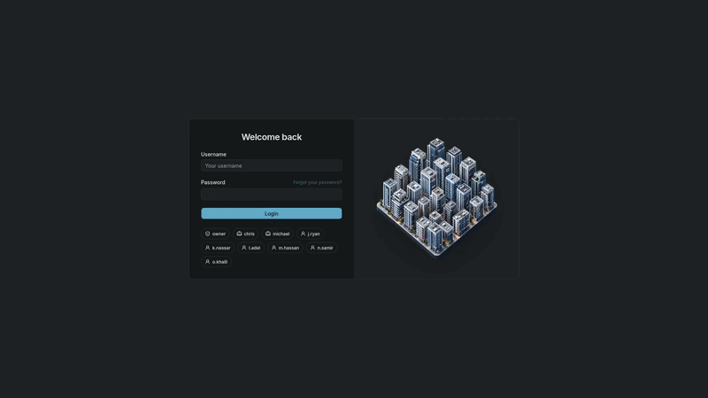

<div align="center">
  <h1>Real Estate CRM</h1>
  <p>Permission-aware operations for real-estate teams.</p>
</div>

<br />

<p align="center">
  <a href="./overview.gif"></a>
</p>

<br />

<p align="center">
  <a href="https://laravel.com"></a>
  <a href="https://react.dev"></a>
  <a href="https://vite.dev"></a>
  <a href="https://www.typescriptlang.org"></a>
  <a href="https://www.postgresql.org"></a>
  <a href="https://redis.io"></a>
  <a href="https://api-crm.swerky.dev/api-docs"></a>
</p>

<p align="center">
  Real-estate CRM for leads, properties, deals, commissions, and reporting.
</p>

<br />

## API Documentation

Explore the production API reference:

<p><a href="https://api-crm.swerky.dev/api-docs">https://api-crm.swerky.dev/api-docs</a></p>

## Architecture

```text
dashboard/  React CRM workspace
    │
    ├── docs/openapi/  API contract → generated TypeScript
    │
    └── server/  Laravel API → PostgreSQL, Redis, Horizon
```

## Hard problems

| Problem | How it is handled |
| --- | --- |
| Contract drift | API schemas are written in `docs/openapi/`; dashboard types are generated from them. |
| Complex access | Policies apply to records, relations, media, activity history, and UI actions. |
| Commission accuracy | Deal changes recalculate allocations in the same database transaction. |
| Historical reporting | Pipeline reports use when a deal entered a status, not its current status. |

## Jobs and queues

| Trigger | Work |
| --- | --- |
| After lead conversion commits | Queue lead conversion work. |
| Every 5 minutes | Queue due daily and monthly sales-pipeline reports. |
| Hourly | Recalculate commissions with overlap protection. |
| Daily | Prune expired reports and Telescope records. |

Analytics report generation runs as a queued job. Horizon processes background work; Redis provides the queue, cache, sessions, and locks.

## Custom Codex skills

`create-api-endpoint` · `create-openapi-export` · `create-dashboard-resource-page` · `convert-resource-preview-to-drawer` · `redesign-dashboard-show-page` · `real-estate-image-generation`
